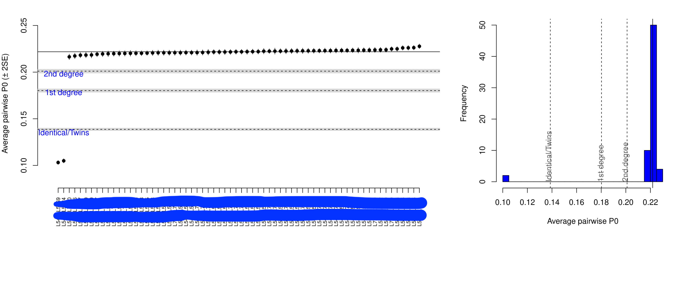

# Kin-relationship estimation for ancient DNA

## Backgroud information

Archaeogenomic research has proven to be a valuable tool to trace migrations of historic and prehistoric individuals and groups, whereas relationships within a group or burial site have not been investigated to a large extent. Knowing the genetic kinship of historic and prehistoric individuals would give important insights into social structures of ancient and historic cultures. Most archaeogenetic research concerning kinship has been restricted to uniparental markers, while studies using genome-wide information were mainly focused on comparisons between populations. Applications which infer the degree of relationship based on modern-day DNA information typically require diploid genotype data. Low concentration of endogenous DNA, fragmentation and other post-mortem damage to ancient DNA (aDNA) makes the application of such tools unfeasible for most archaeological samples. 

Reference:[Jose Manuel Monroy Kuhn et.al., PLoS One 2018](https://journals.plos.org/plosone/article?id=10.1371/journal.pone.0195491)

## Identity by Descent & Identity by	State

The identity by state definition refers to the fact that at some point two individuals, even if they are not related to each other, present the same allele at a specific locus. Because of their un-relatedness this similarity probably arose from a similar mutational event.On the other side, with IBD two individuals happen to share the same allele because of their coancestry.Alleles that are identical by descent are also identical by state. But the opposite is not true. 

A DNA segment is identical by state (IBS) in two or more individuals if they have identical nucleotide sequences in this segment. An IBS segment is identical by descent (IBD) in two or more individuals if they have inherited it from a common ancestor without recombination, that is, the segment has the same ancestral origin in these individuals. DNA segments that are IBD are IBS per definition, but segments that are not IBD can still be IBS due to the same mutations in different individuals or recombinations that do not alter the segment.

The	measurement of SNPs by high	density	microarrays	can	provide	information	about the genotypes among	many loci. SNP genotypes of	two individuals can be compared in terms of	IBS, in which two individuals	are	observed	to	have	identical	0, 1, or 2	alleles	at a given	location.	These	alleles	could	also be IDB	if	0, 1,	or 2 alleles	are	inherited	from a	recent	common	ancestor,	or they	may	be identical	by chance because	the	allele is	very frequent in the	population.

## Related programs

There are many programs for estimating relationship levels, such as [PLINK](https://www.cog-genomics.org/plink2/), [SNPduo](https://journals.plos.org/plosone/article?id=10.1371/journal.pone.0006711), [ERSA](https://www.ncbi.nlm.nih.gov/pmc/articles/PMC3083094/), [KING](https://www.ncbi.nlm.nih.gov/pmc/articles/PMC3025716/), [REAP](https://www.ncbi.nlm.nih.gov/pmc/articles/pmid/22748210/), [GRAB](https://www.ncbi.nlm.nih.gov/pmc/articles/pmid/24586241/), [SEEKIN](https://journals.plos.org/plosgenetics/article?id=10.1371/journal.pgen.1007021) and [GCTA](https://cnsgenomics.com/software/gcta/#Overview).


I sitll need/want to try [SEEKIN](https://journals.plos.org/plosgenetics/article?id=10.1371/journal.pgen.1007021) and [GCTA](https://cnsgenomics.com/software/gcta/#Overview), if I have time.

**Here, I will recommand two programs that work well with ancient DNA or low-coverage data: [READ](https://bitbucket.org/tguenther/read) and [lcMLkin](https://github.com/COMBINE-lab/maximum-likelihood-relatedness-estimation).** 


**Comment:**

**SNPduo** and **ERSA** may be not suitable for ancient DNA because they require high coverage, diploid genotype data as input. I personally tried [KING](http://people.virginia.edu/~wc9c/KING/manual.html), and it is very easy to work with. And [Martin Sikora et.al. Nature 2019](https://www.nature.com/articles/s41586-019-1279-z) used this program in their paper. However, my kin relationship results on psuedo-haploid SNPs data from [KING](http://people.virginia.edu/~wc9c/KING/manual.html) are different from [READ](https://bitbucket.org/tguenther/read). READ might work better for ancient DNA, in my opinion, see [their paper](https://journals.plos.org/plosone/article?id=10.1371/journal.pone.0195491). Or you need diploid data to work with [KING](http://people.virginia.edu/~wc9c/KING/manual.html). I also tried PLINK using psuedo-haploid SNPs data, it can't predict the relationship, in my opinion, it also need diploid genotype.


## Relationship Estimation from Ancient DNA (READ)

Here we are going to use software READ (Relationship Estimation from Ancient DNA) to estimate kin relationships.

Kuhn, J. M. M., Jakobsson, M., & Günther, T. (2018). [Estimating genetic kin relationships in prehistoric populations](https://journals.plos.org/plosone/article?id=10.1371/journal.pone.0195491). PLoS One, 13(4), e0195491.


READ program is publicly available from this [link](https://bitbucket.org/tguenther/read).

### Requirements
Python 2.7 or higher **You need to use ```python2``` to run the ```.py``` file**

GNU, R (assumes the command Rscript can be used)

Unix-like operating system


### Download required files

Download the two scripts ```READ.py``` and ```READscript.R``` from [this site](https://bitbucket.org/tguenther/read/src/default/). You might want to make the file ```READ.py``` executable (chmod +x)


### Preparation of input files

The input for READ are a set of **TPED/TFAM** files containing pseudo-haploid genotypes for a population.


1. Getting a subset of data from main dataset 


```
#making the par file 
par.PACKEDANCESTRYMAP.turkey


genotypename:    UPA21_1104.geno
snpname:         UPA21_1104.snp
indivname:       UPA21_1104.ind
outputformat: eigenstrat    
genotypeoutname: Turkey.geno
snpoutname:      Turkey.snp
indivoutname:    Turkey.ind
poplistname:  Turkey

#run the par file

convertf -p par.PACKEDANCESTRYMAP.turkey 
```

I am extracting 12 ancient individuals of Turkey from our main dataset, so I have smaller dataset to work with. Based on the geographic location of archaeological site, we devided those 12 individuals into three populations/groups: Turkey1, Turkey2 and Turkey3.

The poplistname file Turkey look like this: 

```
Turkey1
Turkey2
Turkey3
```

Modifiy the ```Turkey.ind``` file from 

```
               L5421 U    Turkey1
               L5422 U    Turkey1
               L5423 U    Turkey1
               L5424 U    Turkey1
               L5465 U    Turkey1
               L5466 U    Turkey1
               L5467 U    Turkey1
               L5468 U    Turkey2
               L5469 U    Turkey2
               L7278 U    Turkey1
               L7279 U    Turkey3
               L7280 U    Turkey2
```

to

```
L5421 U Turkey1
L5422 U Turkey1
L5423 U Turkey1
L5424 U Turkey1
L5465 U Turkey1
L5466 U Turkey1
L5467 U Turkey1
L5468 U Turkey2
L5469 U Turkey2
L7278 U Turkey1
L7279 U Turkey3
L7280 U Turkey2

```

using 

```
cat Turkey.ind | awk '{print $1 "\t" $2 "\t" $3}' > new.ind
rm Turkey.ind
mv new.ind Turkey.ind
```

2. Transform eigenstrat format to binary plink file


```
#making the par file 
par.Eigenstrat.PACKEDPED


genotypename: Turkey.geno
snpname: Turkey.snp
indivname: Turkey.ind
outputformat: PACKEDPED
genotypeoutname: Turkey.bed
snpoutname: Turkey.bim
indivoutname: Turkey.fam


#run the par file

convertf -p par.Eigenstrat.PACKEDPED
```
Modify the ```.fam``` file and add population information at the first column (cause population information will be lost during format tansversion)

```
#tab as deliminator

Turkey1	L5421	0	0	0	1
Turkey1	L5422	0	0	0	1
Turkey1	L5423	0	0	0	1
Turkey1	L5424	0	0	0	1
Turkey1	L5465	0	0	0	1
Turkey1	L5466	0	0	0	1
Turkey1	L5467	0	0	0	1
Turkey2	L5468	0	0	0	1
Turkey2	L5469	0	0	0	1
Turkey1	L7278	0	0	0	1
Turkey3	L7279	0	0	0	1
Turkey2	L7280	0	0	0	1

```

Now you should be able to get three binary plink files: ```Turkey.bed```, ```Turkey.bim```, ```Turkey.fam```.


Convert binary plink file to a set of **TPED/TFAM** files (Transposed filesets):

```
# convert binary plink files to .ped and .map format

plink --bfile Turkey --recode tab --out turkey

#convert plain plink file (.ped & .map ) to .tped &.tfam

plink19 --file turkey --recode transpose --out turkeyT 

```

Here is the plink manual for [Data management tools](http://zzz.bwh.harvard.edu/plink/dataman.shtml#recode)

You can get ```Turkey.tped``` and ```Turkey.tfam``` files as an input files for READ program.


### Running READ
Assume you have READ and a pair of files example.tped and example.tfam in your current directory, then you can simply run READ like this:

```python2 READ.py example```

### Results




Two pairs of individuals are predicted as identical twins.

